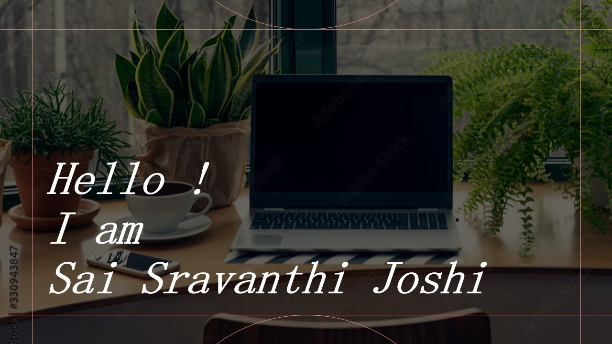

## Contact
📫 Reach me on sravanthi.joshi@yahoo.com 

 
 

## Bio
I am a University of Pittsburgh Bioengineering graduate student with a focus on neural engineering. I am enthusiastic about solving real-world problems and making an impact that contributes to the human-centric challenges.
 
I enjoy the process of designing and implementing deep learning or machine learning projects that make use of sound,text,speech, EEG signals, brain-computer interfaces, or other research fields. I am also interested in exploring new horizons that I have not yet explored.
I am motivated by a challenge and enjoy the thrill of problem solving.
Kaggle challenges have recently piqued my interest.
 
In my spare time, I like to read books and visit national parks. I occasionally spent time to perfect my creative abilities, such as sketching, painting, playing games and playing guitar or drums. My artwork can be found at the link below under other skills.
'#newfoundgames - Journey'
 
## 🕵️‍♀️ Key Expertise
- Build models for human-centric issues
- Fair understanding for Machine Learning  and Deep Learning  
- Skilled in deep learning frameworks and tools, such as TensorFlow and PyTorch, to create and train neural networks for tasks such as image and speech recognition, and predictive modeling
- Expertise on signal processing
- Deep understanding of problem solving and Data Preprocessing
- Working knowledge of AWS and Google Cloud Services
- Team Leadership and Teamwork
- Fair understanding of Data Analysis
- Research and apply knowledge to real-world problems
 
 

## 🎯 Reseach Interests 
- Brain-Computer Interface
- Deep Learning for Bioengineering
- Machine Learning for Neural Signal Processing
- Computer Vision and Image Segmentation for Biomedical Images 
- Neural signals to Speech Conversion
- Adversarial Networks
- Neural Networks
 
 

## 🌱 Collaboration Interests 
- Implementing Deep Learning methods for Neural Engineering
 
 

## 💼 Skills

 

 

 

 

 
 

## Education

| Year  | Degree Obtained                         | University Name                 | Location           |
| ----- | --------------------------------------- | --------------------------      | --------------     | 
| 2023  | MS Bio-engineering - Neural Engineering | University of Pittsburgh        | Pittsburgh,PA, USA |
| 2022  | MS Applied Physics                      | Worcester Polytechnic Institute | Worcester, MA, USA |
| 2016  | M.Sc. Physics (Spl: Materials Science)  |Jain University                  |Bangalore, India    |
| 2013  | B.Sc. Physics,Mathematics &  Electronics|Bangalore University             |Bangalore, India    |

 
 

## Work Experience

<table>
<tr>
	<th align="center">
		
	
 
		<small>
		Year and Role
		</small>
	

	</th>
	<th align="center">
		
	
 
		<small>
		Experience
	</small>
	

	</th>
</tr>
<tr>
<th>
	Jan 2023 - May 2023 
	 
	Teaching Assistant 
	 
	Carnegie Mellon University
	 
	Pittsburgh, PA, USA
</th>

<td> Despite having secured the position through the interview process, I was unable to accept my offer due to visa restrictions. The offered role was to teach, grade, and mentor students in groups of about 15 to help them with projects for the course 11785 - Introduction to Deep Learning.
</td>
</tr>
	
<tr>
<th>
	Aug 2021 - Dec 2021 
	 
	Peer Learning Assistant
	 
	Mechanics Lab - WPI
	 
	Worcester, Massachusetts, USA
</th>

<td> To assist and grade students in the mechanics lab, which was primarily taught in Python to encourage undergraduates and help them understand the physics principles with hand on experience in concepts mechanics lab. 
</td>
</tr>
	
<tr>
<th>
	Aug 2021 - Dec 2021 
	 
	Peer Learning Assistant 
	 
	Modern Physics Lab - WPI
	 
	Worcester, Massachusetts, USA
</th>

<td> To assist and grade students in the mechanics lab, which was primarily taught in Python to encourage undergraduates and help them understand the physics principles with hand on experience in concepts modern physics lab. 
</td>
</tr>
	
	
<tr>
<th >
	Jul 2018 - Jul 2019 
	 
	Subject Matter Expert 
	 
	Chegg India (Online)
	 
	India
</th>

<td>  Creator of physics and math content who places a strong emphasis on real-world application and implementation.
	 
	Sub: Physics and Mathematics 
</tr>
	
<tr>
<th>
	May 2017 - Jun 2017
	 
	Internship
	 
	International Centre for Theoretical Sciences(ICTS)
	 
	Bangalore, KA, India
	
</th>

<td> Cosmology - The End of Space-time and Beyond
</tr>
	
<tr>
<th>
	May 2017 - Sep 2018
	 
	Assistant Teacher
	 
	Pragna Bharathi School 
	 
	Bangalore, KA, India
	
</th>

<td> Taught physics and chemistry to higher secondary students. I put my best to teach
in an encouraging and motivating manner.
</tr>
	
	
<tr>
<th align="center">
	Dec 2016 - May 2017
	 
	Academic Expert
	 
	Vedantu Innovations Pvt. Ltd 
	 
	Bangalore, KA, India
	
</th>

<td> Full time job to evaluate and test the quality of subject experts recruited by the company. The other responsibilities was to develop a structure to coordinate and ensure the knowledge of the experts was up to date.
</tr>	
</table>

 
 

## Social Media

## :book: Code Space

  
 
 

## Presenations and Workshops

| Year    | Type                | Topic                                                      | Location & Event                               | 
| -----   | -------------------------------------------------------------------------------  | --------------------------                     |  
| Mar 2016| Oral Presentation  | Propagation of torsional tube waves in the solar atmosphere |Ahmedabad - Physical Research Laboratory        | 
| Feb 2016| Poster Presentation| Propagation of torsional tube waves in the solar atmosphere |Bangalore - National Conference on RTPS-16      |
| Oct 2015| Poster Presentation|Quiescent Solar Prominence Dynamics: A Mathematical Analysis |Bangalore - Neighborhood Astronomy Meeting IISc |
|Mar 2016 | Participation      | Exploration of inner Solar System Objects                   |Ahmedabad - Physical Research Laboratory        |
|Feb 2016 | Participation      | National Conference on Recent Trends in Physical Sciences   |Bangalore - Jain University                     |
|Jan 2016 | Workshop           |One Day Workshop on Acoustic Microscopy                      |Bangalore - Jain University                     |
|Sep 2015 | Workshop           |Science Academies Lecture Workshop on Crystallography        |Bangalore - IISc                                | 
|Sep 2014 | Workshop           |Statistical Mechanics and Quantum Mechanics                  |Bangalore - IISc                                |

 
 

## &#x1f4c8; GitHub Stats
 
 
 

 
 

## ⚡ Other Skills
Click to view:
 
[Art Work: Behance](https://www.behance.net/sravanthijoshi)
 
[Art Work: Facebook](https://www.facebook.com/sravanthijoshiartwork)
 
 

